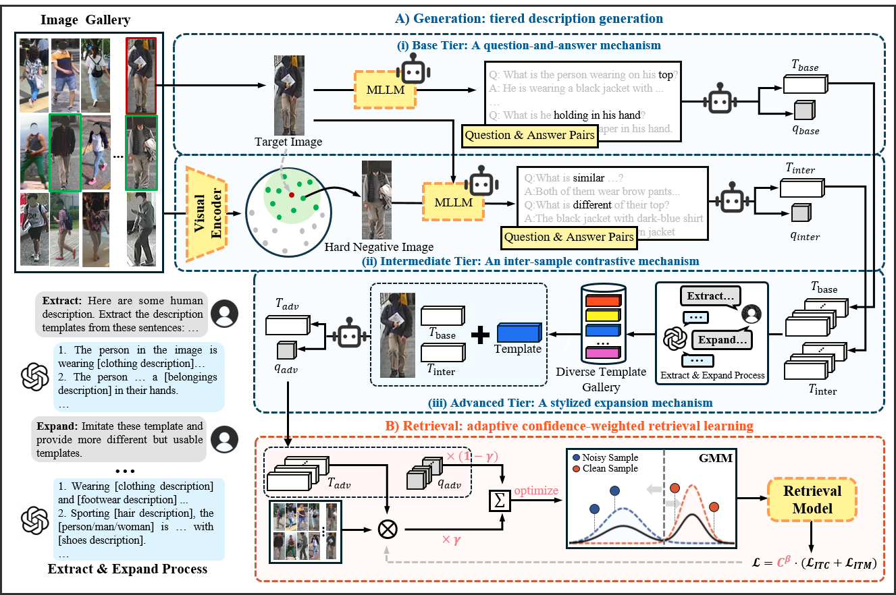

# GTR+：Generative Retrieval for Unsupervised Text Based Person Search
This is the official PyTorch implementation of the paper **Generative Retrieval for Unsupervised Text-Based Person Search** (XXXX XXXX) [Link]()

## Highlights
We propose GTR+ for unsupervised text-based person search, removing the need for expensive human-annotated descriptions. Our method combines a three-tier description generation framework for producing fine-grained and diverse pseudo texts with an adaptive confidence-weighted retrieval learning framework that alleviates the effect of noisy supervision. We also release LargeFine-Person, a large-scale benchmark for unsupervised TBPS pre-training.


## Requirements
We use NVIDIA L40 GPU for training and evaluation.

More details are in [**requirements.txt**](https://github.com/Kismeu/Generative-Retrieval-for-Unsupervised-Text-Based-Person-Search/blob/main/requirements.txt)

## Prepare Datasets
Download the [**CUHK-PEDES**](https://github.com/ShuangLI59/Person-Search-with-Natural-Language-Description) dataset, [**ICFG-PEDES**](https://github.com/zifyloo/SSAN) dataset and [**RSTPReid**](https://github.com/NjtechCVLab/RSTPReid-Dataset) dataset.

```
|-- your dataset root dir/
|   |-- <CUHK-PEDES>/
|       |-- imgs
|            |-- cam_a
|            |-- cam_b
|            |-- ...
|       |-- reid_raw.json
|
|   |-- <ICFG-PEDES>/
|       |-- imgs
|            |-- test
|            |-- train 
|       |-- ICFG_PEDES.json
|
|   |-- <RSTPReid>/
|       |-- imgs
|       |-- data_captions.json
```

### LargeFine-Person Dataset
Download Our pretrain dataset [**LargeFine-Person**]()


## More Examples

